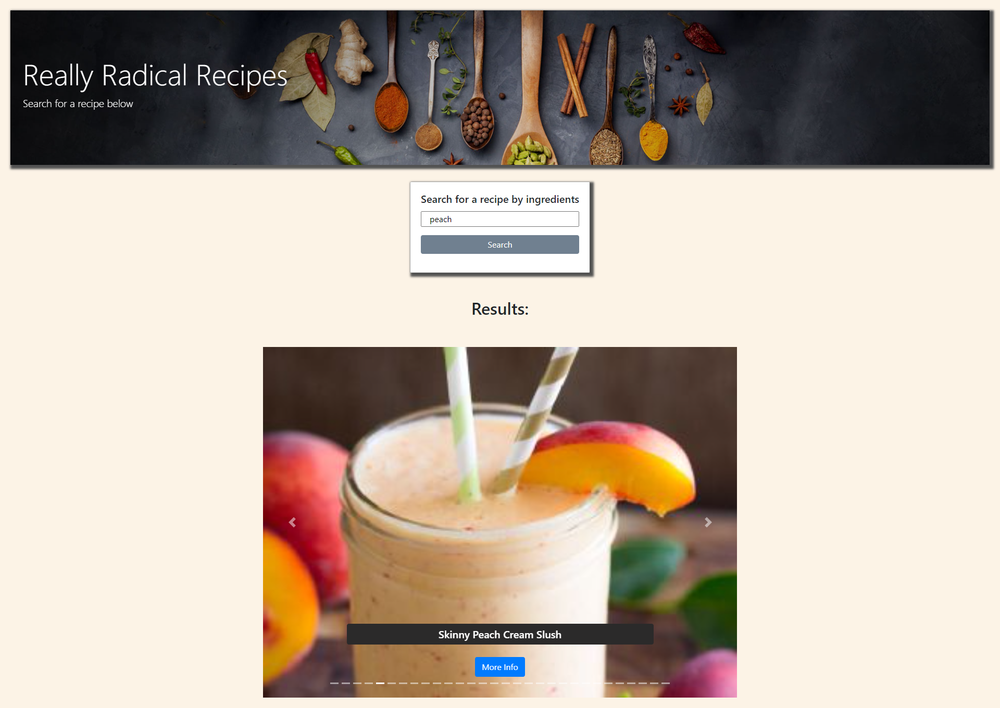

# Really Radical Recipes

Users can search for recipes by typing in one or multiple ingredients and a carousel populated with images and titles appears, allowing the user to select a recipe of their choosing.
After selecting a recipe the user is brought to a page containing a summary of the recipe, a short list of ingredients, and a link to a detailed full recipe. 

# Team members
-Kathy Bradt

-Erika Osterbur

-Jackson Spencer

-Preston Conley 

# Screenshot of website

# Deployed page

[Really Radical Recipes](https://preston0214.github.io/really-radical-recipes/index.html)

# Tech stack
-Bootstrap

-jQuery

-HTML

-CSS

-Animate.CSS

-Spoonacular api

-JavaScript